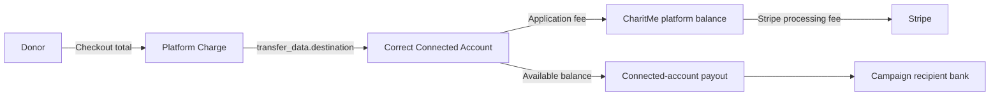

# Stripe Connect Funds-Flow Audit

Audit date: 2026-08-11

## Architecture proved

CharitMe uses Stripe Connect destination charges. `POST /api/donations` creates
a platform Checkout Session whose PaymentIntent has both:

- `transfer_data.destination = <verified campaign recipient account>`
- `application_fee_amount = CharitMe tip + Stripe processing cost`

Stripe creates the platform PaymentIntent and Charge, transfers the charge to
the selected connected account, deducts the application fee there, and deducts
the Stripe processing fee from the platform. The resulting identity is:

```text
donor charge = campaign proceeds + CharitMe net revenue + Stripe processing cost
```

When the donor covers processing, the processing coverage is grossed up to the
fee on the final charge. When the donor declines, the same Stripe cost is
deducted from campaign proceeds. In both cases CharitMe's net is the disclosed
tip, not the gross application fee.



The production endpoint fails closed before Checkout when campaign state,
currency, recipient ownership, account verification, `details_submitted`,
`charges_enabled`, or `payouts_enabled` cannot be proved.

## Critical defects fixed

1. Processing coverage was calculated on the pre-fee subtotal. A $100 donation
   plus $8 tip collected $3.43 while Stripe charged $3.53, reducing CharitMe's
   intended net revenue by $0.10. The shared fee engine now solves the final
   charge using integer-cent fixed-point iteration.
2. Donations without donor-paid processing coverage did not consistently model
   Stripe cost as a campaign deduction. Checkout metadata, owner net, ledger,
   and reporting now use one server-authoritative allocation.
3. Checkout completion recorded transfers and payouts as created before Stripe
   proved either object existed, including synthetic payout IDs. Initial states
   now remain pending until authoritative Stripe events arrive.
4. The webhook treated gross application fee as CharitMe revenue. It now reads
   the Charge balance transaction and Application Fee balance transaction,
   stores Stripe cost separately, and records only the net CharitMe amount.
5. Charge events did not fail reconciliation for wrong destinations, missing
   transfers, owner-net mismatches, or fee mismatches. Those checks now create
   traceable reconciliation exceptions and preserve pending states while Stripe
   data is incomplete.
6. Connected-account payout events were not allocated back to campaign
   transfers. Payout balance transactions are now mapped to destination
   payments, source transfers, campaign payments, and payout allocations.
7. Admin partial refunds used a read-then-write cap and conflated campaign
   principal with donor gross. A locked Supabase reservation now prevents
   cumulative over-refunds; Stripe metadata lets webhook retries repair the
   exact reservation row after a database interruption.
8. Refund and dispute ledgers did not separately preserve principal, tip,
   processing coverage, and Stripe's retained processing cost. Full and partial
   refund and lost-dispute entries now balance without deleting history.
9. Lost disputes could leave campaign proceeds in the destination account. The
   handler now reverses the proven transfer with deterministic Stripe
   idempotency and refuses to acknowledge incomplete reversal.
10. Reconciliation-exception persistence failures were ignored. Financial
    mismatch recording now fails the webhook so Stripe retries.

## Database changes

Migration `20260906010000_stripe_money_flow_integrity.sql`:

- separates donor gross refund and campaign principal refund amounts;
- tracks exactly-once campaign-stat reversal timestamps;
- stores gross Stripe application fee separately from net platform revenue;
- adds connected payout and payout-allocation tables with RLS;
- adds unique Stripe refund identity enforcement;
- adds locked, service-role-only refund reservation and stats RPCs;
- grants financial writes only to `service_role` and read access through owner
  or admin RLS policies.

The matching rollback is
`supabase/rollbacks/20260906010000_rollback_stripe_money_flow_integrity.sql`.

## Stripe sandbox proof

The executable test uses a temporary restricted `rk_test_` key and writes no
credential to disk. On 2026-08-11 it proved platform account
`acct_1TNul7BrwQtGmNLk` with this fixture:

| Component | Amount |
|---|---:|
| Donation principal | $100.00 |
| CharitMe tip | $8.00 |
| Stripe processing coverage | $3.53 |
| Donor charged | $111.53 |

Result: 12/12 scenarios passed, every difference was $0.00, the intentional
failed payout ended with `no_account`, and payout
`po_1U3IwOBCPU8oo7wTi4FDpHWW` reached `paid` for $100.00.

The machine-readable object evidence, including PaymentIntent, Charge, Balance
Transaction, Application Fee, Transfer, two distinct connected destinations,
refunds, dispute, failed payout, and paid payout IDs, is in
`docs/payments/stripe-test-evidence.latest.json`.

## Release gates

| Gate | Status |
|---|---|
| Server-side amount, destination, and readiness validation | PASS |
| Cent-exact fee allocation | PASS |
| Webhook signature and duplicate-event handling | PASS |
| Full and partial refund safety | PASS |
| Dispute and transfer reversal handling | PASS |
| Connected payout allocation and failure handling | PASS |
| Stripe sandbox 12-scenario matrix | PASS |
| Live Supabase columns, tables, RPCs, indexes, RLS, and policies | PASS |
| Live anonymous financial-table access audit (12/12 denied) | PASS |
| Zero-state migration and rollback rehearsal | PENDING |
| TypeScript, ESLint, 4,406 tests, and production build | PASS |
| Isolated staging migration and smoke matrix | PENDING |
| Tagged production release and exact-SHA verification | PENDING |

The production database currently contains every object from the Stripe migration
because the SQL was applied manually on 2026-08-11. Supabase reports 138 of 140
local migrations in its ledger; upstream tombstone repair `20260906000000` and
Stripe integrity migration `20260906010000` remain unrecorded. The tagged workflow
must still apply both idempotent migrations through the supported release path so
the ledger, staging proof, and production schema remain reproducible.

Destination charges make the platform responsible for Stripe fees, refunds,
disputes, and connected-account negative balances. Payments, tax, and legal
counsel must approve that merchant-of-record and liability posture before a
general-availability launch.
